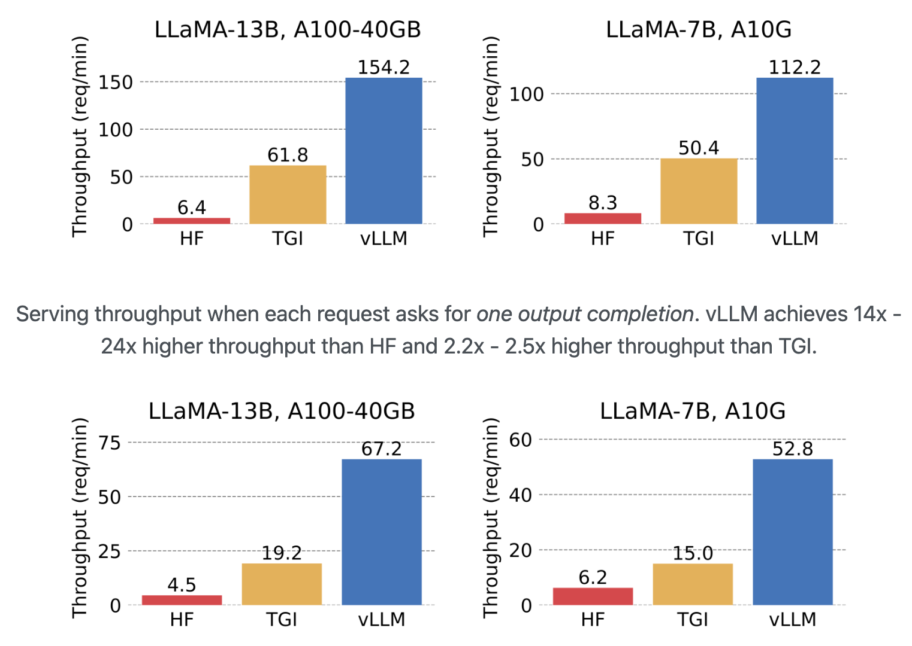
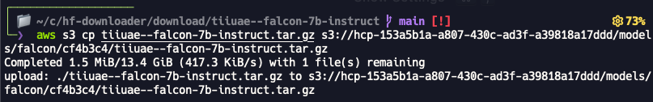

# Chat hosted models: vLLM framework

## Self hosted models

Self-model hosting involves deploying the LLM model within an organization's private infrastructure. This setup ensures that the model and data stay on-premises or within a secure network, which can be crucial for applications with strict data privacy or security requirements.

## What is the vLLM ?

vLLM is a library designed to easily serve LLMs for inference with a high throughput. It is meant to take care of the highly complex deployment of models and ensuring an effective use of GPU memory, thus lowering the deployment time and the hardware requirements.

Some useful resources as a starting point are: </br>
[vLLM website](https://vllm.ai/) </br>
[vLLM Github repo](https://github.com/vllm-project) </br>
[Conference talk about vLLM](https://www.youtube.com/watch?v=5ZlavKF_98U)


## Why do we need vLMM?

Serving LLMs can be as sluggish even with pricey hardware. vLLM is the ultimate open-source toolkit for lightning-fast LLM inference and serving. It packs a secret weapon called PagedAttention, a brainy algorithm that handles LLM’s attention keys and values like a champ. LLM-serving tool delivers up to 24x more speed than HuggingFace (HF) Transformers and and a whopping 3.5x more speed than HuggingFace Text Generation Inference (TGI).

vLLM offers several key features that sets it apart:
#### 1. LLM Deployment

The deployment of LLMs can be quite challenging as it requires a lot of dependencies and technologies like CUDA, docker, various python libraries and some kind of API framework. There are tools like Huggingface's Text-Generation-Inference (TGI) , Nvidia Triton inference server, and FastAPI to make the deployment easier, but they might lead to throughput issues.
#### 2. High throughput of inference requests

vLLM outperforms the Huggingface (HF) deployment frameworks it achieves up to 24x higher throughput compared to HF and up to 3.5x higher throughput than TGI.


#### 3. Seamless Integration:
One of vLLM's strengths is its compatibility with various HuggingFace models, including architectures like GPT-2, GPT-NeoX, Falcon, and more.

## How to get started with vLLM and Local Deployment

### Installation:
[Installation Guide](https://vllm.readthedocs.io/en/latest/getting_started/installation.html)

Requirements: OS: Linux; Python: 3.8 – 3.11; GPU: compute capability 7.0 or higher (e.g., V100, T4, RTX20xx, A100, L4, etc.)

#### Option 1. Install with pip: </br>
```
# (Optional) Create a new conda environment.
conda create -n myenv python=3.8 -y
conda activate myenv

# Install vLLM.
pip install vllm

```

#### Option 2. Build from source:
You can also build and install vLLM from source:
```
git clone https://github.com/vllm-project/vllm.git
cd vllm
pip install -e .  # This may take 5-10 minutes.

```

##### Quickstart:

[Quickstart](https://vllm.readthedocs.io/en/latest/getting_started/quickstart.html)

Before we start with the topic of Quickstart, it is worth noting the supported models and the option of adding a new model.</br>

##### List of supported models:
https://vllm.readthedocs.io/en/latest/models/supported_models.html#supported-models


##### Adding a new model:
https://vllm.readthedocs.io/en/latest/models/adding_model.html#adding-a-new-model

##### Option 1: Offline Batch Inference:
Here we have an example to use vLLM as offline batched inference on a dataset. We use the OPT-125M model.

Example offline Batch Inference:
https://github.com/vllm-project/vllm/blob/main/examples/offline_inference.py

##### Option 2: API Server:
build an API server for a large language model;
Simple Example:

##### Start the server:
python -m vllm.entrypoints.api_server

Query the model in shell:

```
curl http://localhost:8000/generate \

    -d '{
        "prompt": "San Francisco is a",
        "use_beam_search": true,
        "n": 4,
        "temperature": 0
    }'
```

For a more detailed client example: https://github.com/vllm-project/vllm/blob/main/examples/api_client.py

#### Option 3: OpenAI-Compatible Server:
vLLM can be deployed as a server that mimics the OpenAI API protocol. This allows vLLM to be used as a drop-in replacement for applications using OpenAI API

Example: https://github.com/vllm-project/vllm/blob/main/examples/openai_completion_client.py

### Local Deployment:

    There are four options for Deployment. For us to deploy vLLM on AI Core the best option is to deploy it as a Docker

##### Deploying with Docker:
https://vllm.readthedocs.io/en/latest/serving/deploying_with_docker.html
You can build and run vLLM from source via the provided dockerfile. To build vLLM:

```

DOCKER_BUILDKIT=1 docker build . --target vllm --tag vllm --build-arg max_jobs=8

docker run --runtime nvidia --gpus all \
    -v ~/.cache/huggingface:/root/.cache/huggingface \
    -p 8000:8000 \
    --env "HUGGING_FACE_HUB_TOKEN=<secret>" \
    vllm <args...>

```
## vLLM deployment on SAP AI Core

5. Creating Models on AI Launchpad (ML Operations)

Approach: To deploy the vLLM on AI Core, there are two different approaches. The diagram below clearly shows both these approaches:


### Pre-requisites

This guide assumes:

1) Familiarity with SAP AI Core. See [SAP AI Core on BTP](https://learning.sap.com/learning-journey/learning-how-to-use-the-sap-ai-core-service-on-sap-business-technology-platform). </br>
2) Understanding the SAP AI Core deployment workflow. See [SAP AI Core ML Operations Documentation](https://help.sap.com/docs/sap-ai-core/sap-ai-core-service-guide/use-your-model?locale=en-US).</br>
3) Access to JFrog Artifactory. See [Gain Access to SAP Internet Facing Common Repository](https://pages.github.tools.sap/Common-Repository/Artifactory-Internet-Facing-Dev/commonrepo-onboard/#api).</br>
    3.1) For write access to push Docker images,please contact the admin person</br>
or
3) Please use [docker hub](https://hub.docker.com/) for push image.</br>
4) Possession of an active Hugging Face account.</br>
5) Access to the model hosted on HF.</br>
6) Access to the ADB Pipeline .</br>


### Understanding Resources Need for Deployment

Before deploying a LLM on AI Core using vLLM, you will first need to understand the resource plans currently available, as well as the resources required for the model.

The available resource plans on AI Core for IES deployment workflow (tenants with sap-internal service-plan) are the following:

| ResourcePlan ID | GPUs | GPU Memory | Label |
|:---:|:---:|:---:|:---:|
|infer2.l	    |1 A10G	|1 x 24 GB =   24 GB |ai.sap.com/resourcePlan: infer2.l|
|infer2.4xl	|4 A10G	|4 x 24 GB =   96 GB |ai.sap.com/resourcePlan: infer2.4xl|
|train2.8xl	|8 A100	|8 x 40 GB = 320 GB	|ai.sap.com/resourcePlan: train2.8xl|
|train2.8xxl	|8 A100	|8 x 40 GB = 320 GB	|ai.sap.com/resourcePlan: train2.8xxl|

For LLM serving the most important resource KPI is the GPU memory, which depends on how much space the model parameters consume. The model parameters give a rough estimate on how much GPU memory is required. Depending on the precision used i.e. how many digit does each model weight (parameter) have. Think of it in terms of position after decimal point. It is usually 4, 8, 16, 32 bit, which are 0.5, 1, 2, 4 byte. 1 billion bytes are 1GB. As an example Llama-2-70b-chat full precision is 16bit therefore therefore inference requires at least 140 GB of GPU RAM just to load the model into the memory. At FP32, you would need double of that (about ~260Gb to load the model). Furthermore iit is important to understand, that depending on how the LLM is deployed it might only use one GPU and therefore leading to an out of memory error, despite having theoretically enough, when all GPU memory is added up. This very much depends on what is used for inference e.g. vLLM or PyTorch directly, etc. and if the docker container is configured correctly e.g. all the dependencies and PATHS are correctly installed. Also the hardware might not be ready for distributive inference as some GPUs do not support multi-GPU memory distribution. If you want to more about hardware requirements this blog article is a good start: https://www.baseten.co/blog/llm-transformer-inference-guide/ and this Databricks article goes a little more into depth https://www.databricks.com/blog/llm-inference-performance-engineering-best-practices

### Building vLLM Inference Server Docker Image

As the vLLM Inference Server Docker image is fundamentally a Docker image that only contains the vLLM setup, individual developers would NOT be required to build a new vLLM image every time a new deployment is conducted. As such, a standardised repository path is created to host the [latest] image that can be re-used across different deployments.

```
# From dir where you want to clone the repository:
git clone <https://github.tools.sap/Artificial-Intelligence-CoE/AICore-vLLM.git>

# From the AICore-LLM directory
cd inference-server

# Build docker image
docker build -t <dockerRepository>/aicore-vllm:v<ddmmyy>-<minorVersion> .
# e.g.,
# docker build -t ies-aicoe.common.repositories.cloud.sap/genai-platform-exp/aicore-vllm:v090124-01 .

# Push docker image to the registered repository
docker push <dockerRepository>/aicore-vllm:v<ddmmyy>-<minorVersion>
# e.g.,
# docker push ies-aicoe.common.repositories.cloud.sap/genai-platform-exp/aicore-vllm:v090124-01

```
For standardisation purposes, the following naming convention denoted above must be adhered: </br>

1) Our container image repository is located at: ies-aicoe.common.repositories.cloud.sap/genai-platform-exp> </br>
2) vLLM images are to named as: aicore-vllm </br>
3) Version tag format are to be named as: v<ddmmyy>-<minorVersion>, where the minorVersion starts from 01.</br>

An example of the full naming structure would be:

```
ies-aicoe.common.repositories.cloud.sap/genai-platform-exp/aicore-vllm:v090124-01
```

### Downloading HuggingFace Model Artefacts and saving to S3 Object Store

#### 1. Using HF downloader and AWS CLI

1.Download the model using HF downloader.
```
NOTE: This section is currently demonstrating the local download process of model artefacts.
Ideally, we will be implementing a pipeline to handle both download and transferring of model artefacts in the subsequent sprints.
```
To download the model and its corresponding artefacts, please use the following repository. The HuggingFace model downloader provides the following functionalities:

1) Support for concurrent files download </br>
2) Resumable download </br>
3) Filter files download based on patterns and serialization format (e.g., .bin, .pt, .safetensors) </br>
4) Package model in tarball format for further usage (e.g., vLLM) </br>

For example to download tiiuae/falcon-7b-instruct you would use this command:
```

poetry run python3 src/hf_downloader.py --model-name "tiiuae/falcon-7b-instruct" \
                                        --revision "cf4b3c42ce2fdfe24f753f0f0d179202fea59c99" \
                                        --max-workers 8 \
                                        --save-as-tarfile \
                                        --tarfile-name "tiiuae--falcon-7b-instruct"

```
For full options regarding the HuggingFace downloader CLI, refer to this [repository]().

The model artefacts will be saved as a tarfile format that will be later transffered to our S3 bucket and be used in the inference process.

The content of the tarball file should follow this directory structure:

```
tiiuae--falcon-7b-instruct
├── models--tiiuae--falcon-7b-instruct
│   ├── blobs
│   │   ├── 02b145e38790e52c2161b8d5ed97ee967bc3307e
│   │   ├── 1d92decce70fb4d5e840694c6947d2abfef27fdf
│   │   ├── 1de823c84b1c8b9889ac2a6c670ec6002a71776abd42cdf51bb3acd4c9938b29
│   │   ├── 24f2d2e20d26ae4f0729da0d008e0ee6d81fc560
│   │   ├── 24f43d813328da380b3d684c019f9c6d84df6b50
│   │   ├── 4aa644a0eca5b539ec8703d62d4b957c74a54963
│   │   ├── 66acf4bebb68593952a51575cb02dbf258a606e236c6b82b6b60c3b1e9089e66
│   │   ├── 70c059b13f10f3e20d34a31174dd7da53cfb93ad
│   │   ├── 834822cbe81585262b727c3fdbe520a34fd24ad4
│   │   ├── 84d8843072cbc300692c6bccff5b9c08c430498e
│   │   └── def8c2bf7e0f85be115be9e6a79dd3c5aa50a99d
│   ├── refs
│   │   └── main
│   └── snapshots
│       └── cf4b3c42ce2fdfe24f753f0f0d179202fea59c99
│           ├── config.json -> ../../blobs/84d8843072cbc300692c6bccff5b9c08c430498e
│           ├── configuration_falcon.py -> ../../blobs/def8c2bf7e0f85be115be9e6a79dd3c5aa50a99d
│           ├── generation_config.json -> ../../blobs/02b145e38790e52c2161b8d5ed97ee967bc3307e
│           ├── handler.py -> ../../blobs/70c059b13f10f3e20d34a31174dd7da53cfb93ad
│           ├── modeling_falcon.py -> ../../blobs/834822cbe81585262b727c3fdbe520a34fd24ad4
│           ├── pytorch_model-00001-of-00002.bin -> ../../blobs/66acf4bebb68593952a51575cb02dbf258a606e236c6b82b6b60c3b1e9089e66
│           ├── pytorch_model-00002-of-00002.bin -> ../../blobs/1de823c84b1c8b9889ac2a6c670ec6002a71776abd42cdf51bb3acd4c9938b29
│           ├── pytorch_model.bin.index.json -> ../../blobs/1d92decce70fb4d5e840694c6947d2abfef27fdf
│           ├── special_tokens_map.json -> ../../blobs/24f43d813328da380b3d684c019f9c6d84df6b50
│           ├── tokenizer.json -> ../../blobs/24f2d2e20d26ae4f0729da0d008e0ee6d81fc560
│           └── tokenizer_config.json -> ../../blobs/4aa644a0eca5b539ec8703d62d4b957c74a54963
└── version.txt

```

2.Saving model artefacts to S3 object store.

In the IES GenAI Platform deployment workflow, we do not depend on the vLLM to download models from HuggingFace, as we utilised our own downloader in the previous section.

To copy the locally downloaded model artefacts tarfile to our AWS S3 bucket, use the following command:

```
aws s3 cp <tarfileName> s3://<bucket-id>/models/<modelFamily>/<revision>/<tarfileName>
# eg. aws s3 cp tiiuae--falcon-7b.tar.gz s3://<bucket-id>/models/falcon/cf4b3c4/tiiuae--falcon-7b-instruct.tar.gz

```
For standardisation purposes, please adhere to the following path prefix:

```
s3://bucket/models/<modelFamily>/<revision>

```
For revision, if the revision is cf4b3c42ce2fdfe24f753f0f0d179202fea59c99, you may just use the first 7 characters: cf4b3c4.


### Creating LLM ServingTemplate for AI Core Deployment

All our existing self-hosted LLM ServingTemplates can be found under the following repository. For this documentation, you can find the ServingTemplate we are using to deploy the falcon-7b-instruct model here.

As the ServingTemplate may be complicated with various parameters to change, below provides the shortened version that highlights the important changes to make:

```
apiVersion: ai.sap.com/v1alpha1
kind: ServingTemplate
metadata:
  name: falcon-7b-instruct-cf4b3c4     # this is the servingtemplate name
  annotations:
    scenarios.ai.sap.com/description: "SAP Hosted models on SAP AI Core"
    scenarios.ai.sap.com/name: "sap-hosted-model"
    executables.ai.sap.com/description: "AI Core executable for Open-source LLMs"
    executables.ai.sap.com/name: "aicore-opensource"
  labels:
    scenarios.ai.sap.com/id: "sap-hosted-model"       # scenarioID for servingTemplate
    executables.ai.sap.com/id: "aicore-opensource"    # executableID for servingTemplate
    ai.sap.com/version: "1.0.0"
spec:
  inputs:
    parameters:
      - name: image                                   # vLLM docker image, use the latest standardised one on our image repository
        type: "string"
        default: "ies-aicoe.common.repositories.cloud.sap/genai-platform-exp/aicore-vllm:v090124-01"
      - name: resourcePlan                            # resourceplan
        type: "string"
        default: "infer2.4xl"
              ...
      - name: modelId                                 # HuggingFace model ID
        type: "string"
        default: "tiiuae/falcon-7b-instruct"
      - name: revision
        type: "string"
        default: "cf4b3c42ce2fdfe24f753f0f0d179202fea59c99"
      - name: modelName                               # vLLM application model name
        type: "string"
        default: "tiiuae--falcon-7b-instruct"
    artifacts:
    - name: tiiuae_falcon_7b_instruct                 # artifact for object store (MUST be alphanumeric and underscore)
  template:
    apiVersion: "serving.kserve.io/v1beta1"
    metadata:
            ...
    spec: |
      predictor:
                ...
        containers:
                    ...
          - name: STORAGE_URI
            value: "{{inputs.artifacts.tiiuae_falcon_7b_instruct}}"   # change the following name to the `artifacts` values
                        ...
          volumeMounts:
                        ...
        volumes:
                    ...

```

### Deployment settings on AI Launchpad

#### 3. Creating Application to Sync ServingTemplate (SAP AI Core Administration)

#### 4. Creating Object Store Secret on AI Launchpad (ML Operations)

#### 5. Creating Models on AI Launchpad (ML Operations)

#### 6. Creating Configurations for Deployment (ML Operations)

#### 7. Creating Deployment for LLM (ML Operations)

## What are the pros & cons vLMM?

+ seems very fast

+ seems very easy to use

- Really new framework: small community, maybe not mature (unknown problems), may not be the dominant framework in the future and then not be maintained.

- have to write the connector yourself for less common models

## Source Code
Compelte source code [Source Code](https://github.com/GAmaranathaReddy/GenAI-Hub/tree/main/src/vllm-runtime) {:target="\_blank"}.
