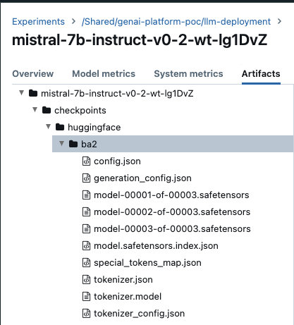
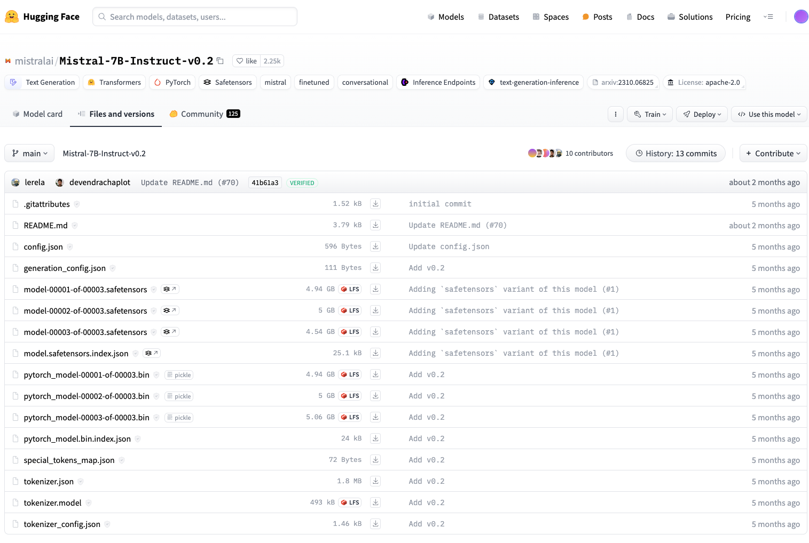

# Fine-tuned models: vLLM framework
## About vLLM
[About vLLM](../chat-models/deployment.md#what-is-the-vllm-)

## How to get started with vLLM and Local Deployment
[Local deployment](../../llm-deployments/chat-models/deployment.md#installation)

## Retrieving, Packaging Fine-tuned Model Weights and Saving to S3 Object Store

``` Note
The key idea for the fine-tuned model weights packaging is that: 1) it must be HuggingFace Hub format with specific required files.
```
For our exploration in hosting the fine-tuned models, we downloaded model weights that were fine-tuned via ADB but utilised models that are downloaded from HuggingFace. For example, we can take a look at the following model artifacts available post fine-tuning:
 

On the left, we have the model artifacts setup from ADB post fine-tuning, while on the right, we have the original model weight setup hosted on HuggingFace Hub. As you can see, the following files should always be present to ensure that inference via vLLM can work as expected:

1.config.json </br>
2.generation_config.json </br>
3.weights (.safetensors, .bin format) </br>
4.model.{weight_format).index.json </br>
5.special_tokens_map.json </br>
6.tokenizer.json </br>
7.tokenizer.model </br>
8.tokenizer_config.json </br>

```note
If you have used model downloaded from HuggingFace Hub for model fine-tuning, rest assured the format post fine-tuning should usually work.
```
Once you retrieved all the relevant files, you will put them in a single folder like the following:

```

.
└── main
    ├── config.json
    ├── generation_config.json
    ├── model-00001-of-00003.safetensors
    ├── model-00002-of-00003.safetensors
    ├── model-00003-of-00003.safetensors
    ├── model.safetensors.index.json
    ├── special_tokens_map.json
    ├── tokenizer.json
    ├── tokenizer.model
    └── tokenizer_config.json

```

For instance, if you were to leave the model weights set up like the above, when you compress the weights folder into a tarfile as indicated in [Chat  models: vLLM framework](../chat-models/deployment.md), your path to the weights should be: /main .

As another example, if you will to put the model weights in the following structure:
```
.
├── snapshots
│   └── main
│       ├── config.json
│       ├── generation_config.json
│       ├── model-00001-of-00003.safetensors
│       ├── model-00002-of-00003.safetensors
│       ├── model-00003-of-00003.safetensors
│       ├── model.safetensors.index.json
│       ├── special_tokens_map.json
│       ├── tokenizer.json
│       ├── tokenizer.model
│       └── tokenizer_config.json

```
Your new path to the weights should be: /snapshots/main
Once you have figured your preferred way of storing the weights, you can simply compress the model weights folder as below:

```

# tar -cf {tarfile-name}.tar.gz {model-weights-folder-name}

tar -cf mistralai-Mistral-7B-Instruct-v0_2-ft.tar.gz models--mistralai--Mistral-7B-Instruct-v0_2

# or

tar -cf model-weights.tar.gz snapshots      # based on the above examples

# or

tar -cf model-weights.tar.gz main           # based on the above examples

```
## How to get started with vLLM and Docker Deployment

### Building vLLM Inference Server Docker Image
As the vLLM Inference Server Docker image is fundamentally a Docker image that only contains the vLLM setup, individual developers would NOT be required to build a new vLLM image every time a new deployment is conducted. As such, a standardised repository path is created to host the [latest] image that can be re-used across different deployments.

```
# From dir where you want to clone the repository:
git clone <https://github.tools.sap/Artificial-Intelligence-CoE/AICore-vLLM.git>

# From the AICore-LLM directory
cd inference-server

# Build docker image
docker build -t <dockerRepository>/aicore-vllm:v<ddmmyy>-<minorVersion> .
# e.g.,

# Push docker image to the registered repository
docker push <dockerRepository>/aicore-vllm:v<ddmmyy>-<minorVersion>
# e.g.,

```

### Run vLLM Inference via Docker Image


## AICore deployment
[AICore deployment](../chat-models/deployment.md#vllm-deployment-on-sap-ai-core)

## Source Code
Compelte source code [Source Code](https://github.com/GAmaranathaReddy/GenAI-Hub/tree/main/src/vllm-runtime) {:target="\_blank"}.

